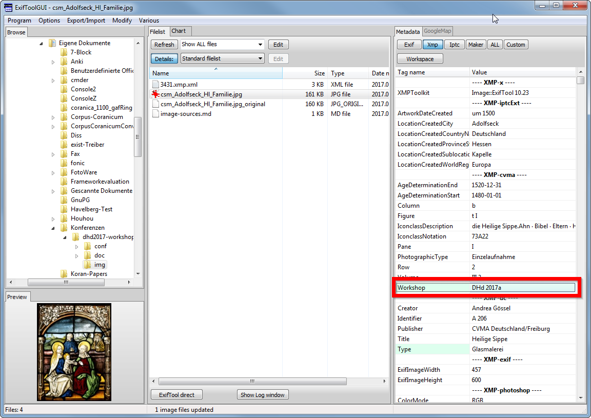
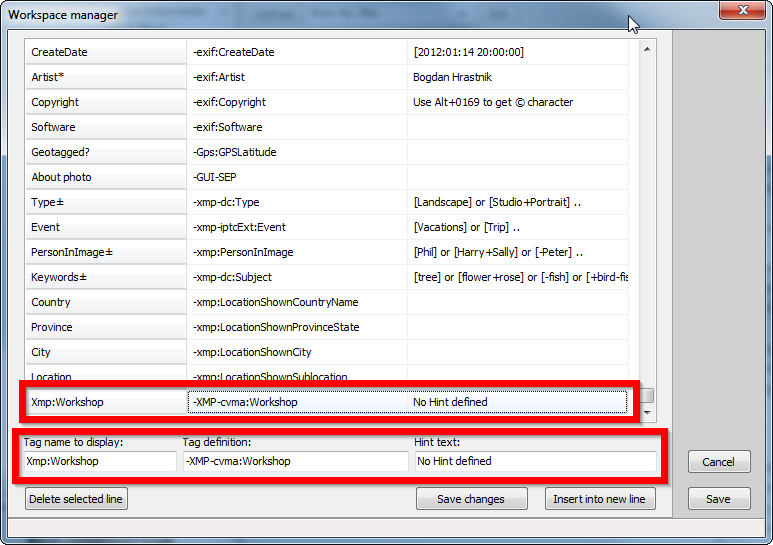
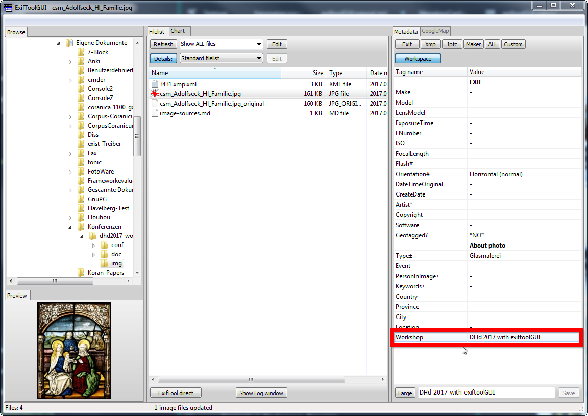

# Tutorial exiftoolGUI
*Oliver Pohl, Torsten Schrade*

## Allgemeines

* Free Open Source Software

* exiftoolGUI (Windows only)
  - Download: http://u88.n24.queensu.ca/~bogdan/exiftoolgui516.zip
* pyExiftoolGUI (plattformunabhängig)
  - Download: https://hvdwolf.github.io/pyExifToolGUI/
  - Unstable

## exiftoolGUI

### Vorbereitung
* exiftool installieren
* exiftool-Konfiguration muss im PATH angegeben sein
* exiftool-Konfiguration kann sonst *nicht* von exiftoolGUI benutzt werden
* Mit Terminal/CMD kopieren
  ```
  $ cp conf/cvma.ExifTool_config C:\Windows
  ```
* Der Windows-Explorer erwartet einen Dateinamen vor dem Punkt. Daher muss mit dem Terminal umbenannt werden.

### exiftoolGUI Benutzung

* Rechte Spalte > XMP
  - Zeigt alle XMP Daten an
  

* Workspace: Metadaten bearbeiten
  - Aus den anderen Reitern ein Feld auswählen -> Rechtsklick -> "Add tag to workspace"
  - Beispiel: Workshop
  

  - Im Workspace-Reiter unten einen neuen Wert eingeben
    + Eingabe mit Enter bestätigen
    + Save-Button klicken
  
  

  - Wenn Konfiguration nicht in ```C:\Windows``` hinterlegt wurde, gibt es eine Fehlermeldung
  

  - Wenn Konfiguration richtig ist und geladen wurde kommt keine Fehlermeldung:
  

* Workspace anpassen

  - Program > Workspace Manager
  

  - XMP-Felder und Labels bearbeiten
  

  - Label wird in der Bearbeitungsansicht geändert
  

## Tests

### exiftool

* Eingegebenen Werte mit exiftool überprüfen

```
$ exiftool -config conf/cvma.ExifTool_config -xmp-cvma:Workshop img/csm_Adolfseck_Hl_Familie.jpg
```
> Workshop                        : DHd 2017 with exiftoolGUI

### Fotostation

* Metadaten mit Fotostation betrachten


