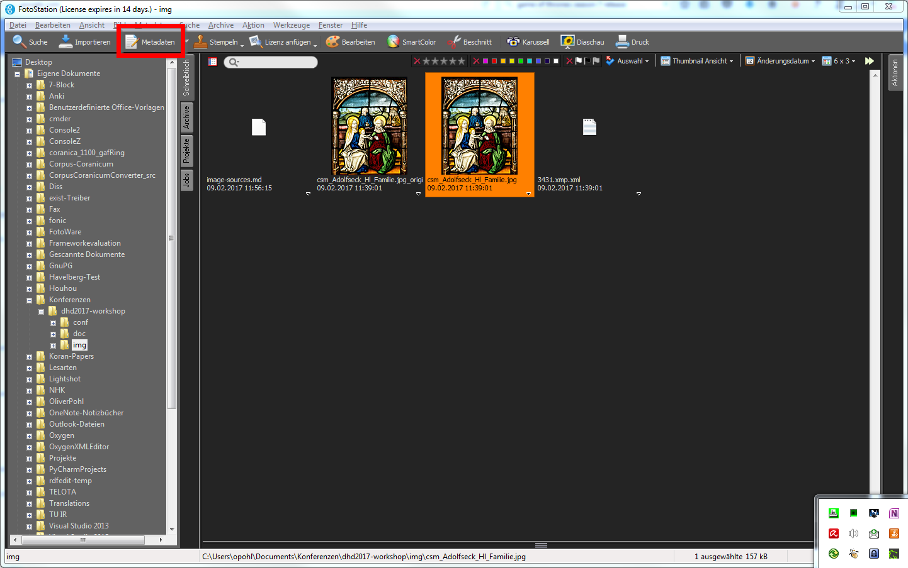
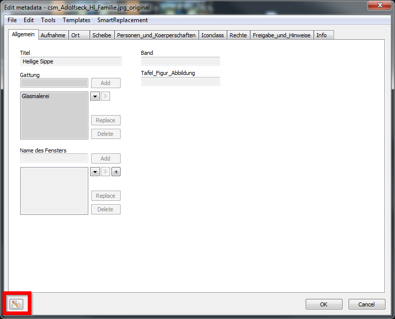
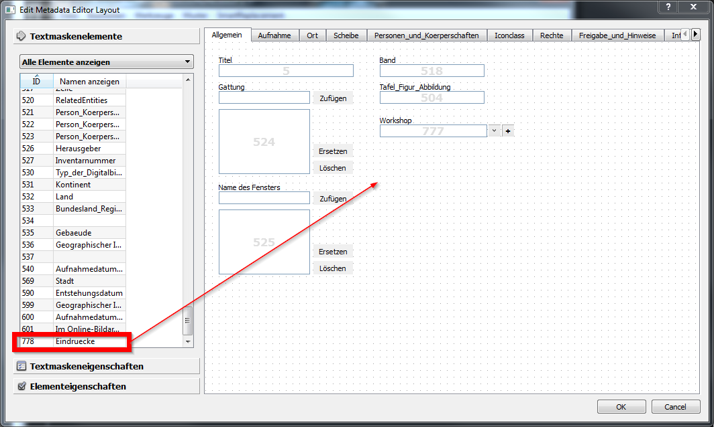
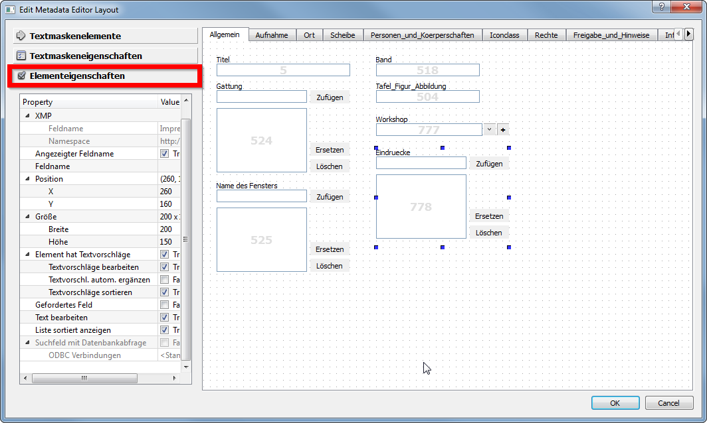
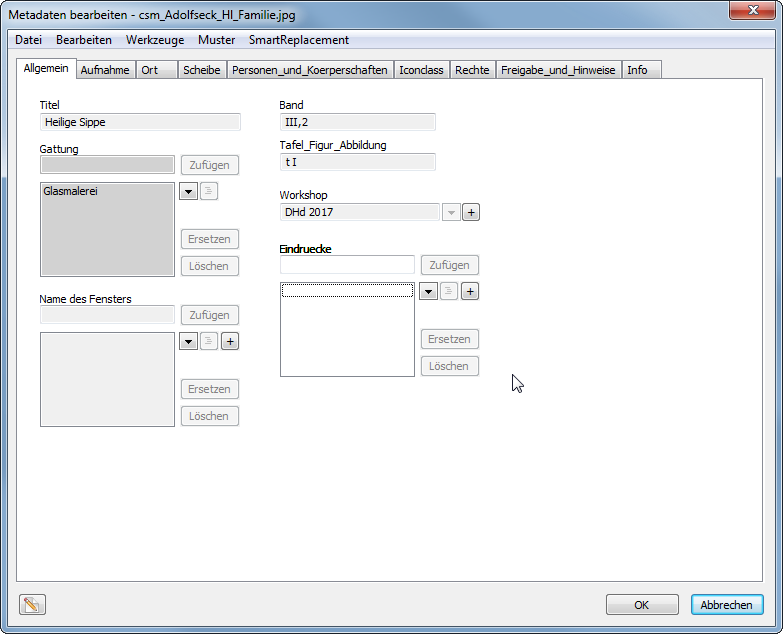

# Tutorial Fotostation
*Oliver Pohl, Torsten Schrade*

## Allgemeines

* Windows / MacOS only
* Proprietäre Software
* Download: https://www.fotostation.com/download-thanks/
* 14-Tage Testversion bei Angabe einer E-Mail-Adresse

## Fotostation: Pro und Kontra

### Pro

* Lichttisch (Bilderbrowser)
* Verschiedene Datei- und Metadatenansichten
* Konfigurierbare Ansichten und Exporte
* Eigene XMP-Standards konfigurierbar
* Eigene GUIs zur Metadateneingabe konfigurierbar
* Lesen, Schreiben und Indexieren von XMP-Daten
* Import und Export von Konfigurationen möglich, erleichtert Kollaboration

### Kontra

* Eingeschränkter Support beim Lizenzerwerb
* Proprietär und kostenpflichtig
* Einschränkung in der XMP-Konfiguration
    - Bags of Structs können nicht geschrieben werden
    - Erfordert ggf. Nachpflege von Daten
* Beeinträchtigte Leistung bei Netzwerkfreigaben bei Einzelplatzlizenzen (besonders bei TIF-Archiven)

### Warum Fotostation beim CVMA Potsdam?

* Anwendungsprofil, das derzeit nicht durch Free Open Source Software abgedeckt wird
* Einfach zu konfigurieren und zu pflegen
* Einfach zu benutzen

## Nutzung

### Konfiguration: Import

* CVMA-Konfiguration: in ```conf/fotostation_config```
* Datei > Konfiguration verwalten > Konfiguration laden
* Wichtig: In den Root-Ordner der Konfiguration gehen. Zwei Ordner sollten sichtbar sein:
    - Shared
    - Win
* FotoStation neu starten, damit die Konfiguration geladen wird
* Export funktioniert ähnlich

### Metadaten bearbeiten

* Bild auswählen
* Metadaten bearbeiten klicken
    - Werkzeugleiste
    - Rechtsklick > Metadaten bearbeiten
    - Ctrl + T




## Konfiguration & Workflow

### Neue Felder definieren

* Vorhandene Felder in Fotostation in aktueller Konfiuration anzeigen
  - Datei > Metadaten (siehe links) > Konfiguration... > Konfigurieren
  

* Metadatenkonfiguratiom ```Shared/Metadata/MedataConfiguration.xml```
  - Namensräume werden deklariert
  ```  <Namespace url="http://www.corpusvitrearum.de/cvma/1.0/" name="cvma" alias="cvma"/>
  ```
  - Felder werden definiert
  ```
  <Field valueType="Text" guiLabel="Iconclass_Beschreibung" maxSize="25600" id="506" ns="cvma" fieldType="Single" name="IconclassDescription" isMultiline="true"/>
  <Field valueType="Text" guiLabel="Iconclass_Notation" maxSize="256" id="507" ns="cvma" fieldType="Bag" name="IconclassNotation" isMultiline="false"/>
  ```

  - Wichtige Attribute
    + valueType: Text, Boolean, Integer, Float
    + guiLabel: Bezeichnung des Feldes in der Fotostation GUI
    + maxSize: Maximale Zeichenlänge
    + id: Eindeutiger Identifikator des Feldes als Zahl
    + ns: Namensraum. Muss in der Konfiguration definiert sein!
    + fieldType: Single, Bag
    + name: Name des Feldes im Metadatenstandard
    + isMultiline: true, false

* Neue Felder in Konfig-Datei anlegen

  - Neues Textfeld im cvma-Namensraum anlegen
    + valueType: Text
    + guiLabel: Workshop
    + maxSize: 256
    + id: 777
    + ns: cvma
    + fieldType: Single
    + name: Workshop
    + isMultiline: false
  ```
  <Field valueType="Text" guiLabel="Workshop" maxSize="256" id="777" ns="cvma" fieldType="Single" name="Workshop" isMultiline="false"/>
  ```

* Konfiguration erneut importieren und Fotostation anschließend neu starten

  - Überprüfen, ob neues Feld geladen wurde
  - Datei > Metadaten (siehe links) > Konfiguration... > Konfigurieren


* Neues Feld in Editor-View anlegen

  - Metadaten eines Bildes bearbeiten
  - Bleistift-Button unten links drücken
  
  - Neues Fenster öffnet sich. Metadatenbearbeitungsansicht kann nun bearbeitet werden.
  - Das neue Feld "Workshop" (777) aus der linken Spalte bei "Textmaskenelemente" auf die Arbeitsfläche ziehen.
  
  - Das Feld ist nun auf der Arbeitsfläche verankert. Speichern mit dem "OK" Button.
  
  - Daten können nun in das Feld eingegeben werden. Beispiel: "DHd 2017"
  

### Kontrollierte Vokabulare

* Neues Textfeld im cvma-Namensraum anlegen: ```Shared/Metadata/MedataConfiguration.xml```
  - valueType: Text
  - guiLabel: Eindruecke
  - maxSize: 256
  - id: 778
  - ns: cvma
  - fieldType: Bag
  - name: Impressions
  - isMultiline: false
```
<Field valueType="Text" guiLabel="Eindruecke" maxSize="256" id="778" ns="cvma" fieldType="Bag" name="Impressions" isMultiline="false"/>
```

* Feld konfigurieren
  - Feld hinzufügen
  

  - Feld konfigurieren
  

  - Folgende Optionen
    + Element hat Textvorschläge: Nutzern den Zugriff auf eine Vorschlagsliste ermöglichen
      - Textvorschläge bearbeiten: Nutzer dürfen die Vorschlagsliste erweitern
      - Textvorschläge automatisch ergänzen: Auto-Complete aktivieren (kann Nachteile haben)
      - Textvorschläge sortieren: Alphabetische Sortierung
    + Textfeld bearbeiten
      - True: Freitext eingaben möglich -> Werte außerhalb der Vorschlagsliste
      - False: Nur Werte innerhalb der Vorschlagsliste -> kontrolliertes Vokabular

  - Kontrolliertes Vokabular verwalten

    + Option 1: via Fotostation
      - Textvorschläge bearbeiten aktivieren
      - In der Bearbeitungsansicht auf den "+"-Button klicken
      
      
      - Danach bei bedarf Vorschlägserweiterung wieder deaktivieren

    + Option 2: Konfigurationsdatei anpassen
      -  Vorschlagslisten liegen im folgenden Verzeichnis der Fotostation-Konfiguration: ```Win/Backup/Metadata/Quick Lists```
      - Dort dann die ```ql_[feld_id].txt``` bearbeiten/anlegen
      - Beispiel: ```ql_778.txt``` bearbeiten/anlegen
      - Folgende Werte hinzufügen (jede Zeile ein Wert)
      ```
      Super
      Toll
      Wow
      Meh
      ```
      - Speichern und Konfiguration neu laden


## Testmöglichkeiten

* Kompatibilität zu exiftool überprüfen
* Überprüfen, ob die Daten geschrieben wurden

### Test mit exiftool

* Voraussetzung: Das neue Feld in die exiftool-Konfiguration hinzufügen
  - ```conf/cvma.ExifTool_config``` mit Texteditor bearbeiten
  - ```Workshop => { }``` in das cvma-Array hinzufügen
  - Speichern.

* Mit dem Terminal/CMD testen:
```
$ exiftool -config conf/cvma.ExifTool_config -xmp-cvma:Workshop img/csm_Adolfseck_Hl_Familie.jpg
```
> Output sollte der eingetragene Wert sein

### Test mit Texteditor
Bild mit Texteditor öffnen (Notepad++)

